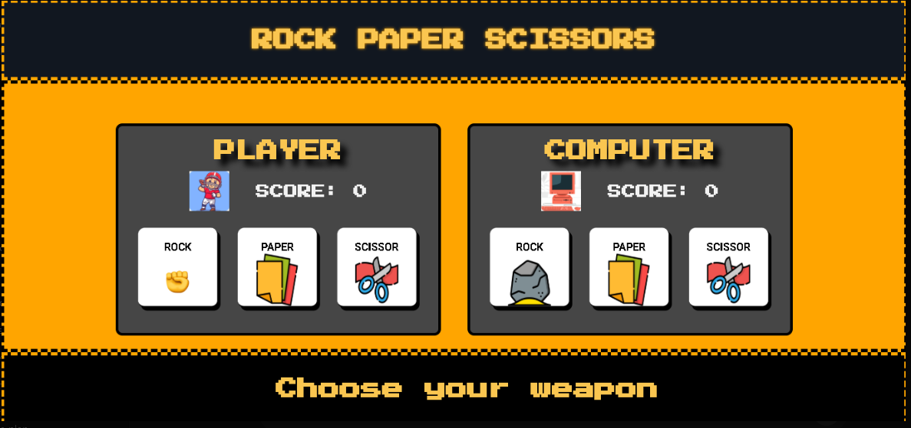
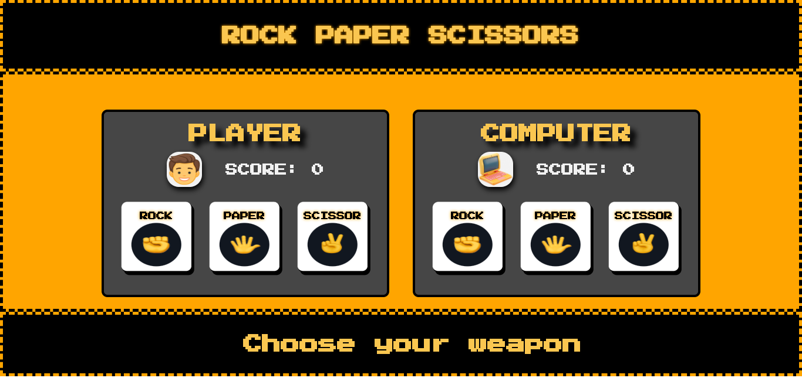

Rock Paper Scissors 🎮✊📄✂️

An interactive, browser-based Rock Paper Scissors game with a modern UI, responsive layout, and smooth game flow. Originally built in October 2024, this project was fully redesigned on June 27, 2025.

🌐 Live Demo »https://mohammedshanid8428.github.io/Rock-Paper-Scissor/
📂 View Source Code »https://github.com/mohammedShanid8428/Rock-Paper-Scissor

📌 Features
🧠 Computer generates random choices using Math.random() * 3
🥇 First to reach 5 points wins the game
💡 Real-time feedback after each round (win/lose/draw)
🪟 Game over popup with a replay option
🎨 Colored border indicators for win/loss/draw status
📱 Fully responsive layout for desktop and mobile
🧑‍🎨 Custom fonts and styled buttons
📆 Development Timeline
Initial Version: April 2025

Basic layout: score, buttons (rock, paper, scissors), result display
Functionality based on simple DOM updates
Static vertical stacking of containers
Redesigned: June 25, 2025

Entire layout restructured for better visual flow
Responsive design with improved typography and spacing
Added feedback visuals through gameStatusIndicator()
Game Over screen with proper outcome messages
Improved animations and mobile compatibility

🧩 Technologies Used
HTML – Semantic structure
CSS – Custom animations, layout design, media queries
JavaScript – Game logic, DOM manipulation, interactivity

💻 Screenshots
Old Version:

Redesigned Version:

👤 Author Mohammed Shanid.T Frontend Developer | MERN Stack Enthusiast
